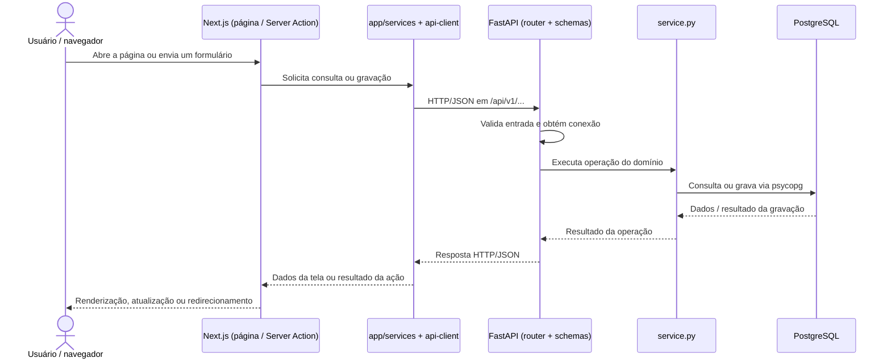

# OpsHub Facilities

Aplicação Next.js para indicadores de facilities, acompanhamento de chamados e criação de solicitações. O frontend utiliza o FastAPI como backend; somente o processo Python acessa o PostgreSQL.

## Arquitetura

```text
Next.js (`app`, `shared`, `src/server`)
  -> cliente HTTP server-side (`src/server/api-client.ts`)
  -> FastAPI (`backend/app/api`, com rotas versionadas em `api/v1`)
  -> psycopg / PostgreSQL
```

As mídias são servidas diretamente pelo FastAPI em URLs de mesma origem sob `/api/v1`. Em desenvolvimento, o Next.js encaminha somente essas rotas ao endereço interno configurado em `BACKEND_API_URL`; em produção, o proxy de borda pode aplicar o mesmo roteamento.

A API mantém os módulos de domínio diretamente em `backend/app/api` e é organizada em `checklist`, `membership`, `organization`, `request`, `request_task` e `service_catalog`. Os domínios separam regras e persistência (`service.py`) e HTTP (`router.py`); contratos específicos ficam em `schemas.py`, quando necessário, e contratos compartilhados em `entities.py`. Os módulos Python usam `_` onde hífens não são identificadores válidos; as URLs públicas preservam `/request-tasks` e `/service-catalog`.

## Elementos do frontend (`app/`)

Os nomes existentes no projeto são `services/`, `entities/navigation_entities/` e `entities/concrete_entity/`.

### `services/` — serviços da aplicação

Executam os casos de uso solicitados pelas páginas e Server Actions, como consultar indicadores ou criar uma solicitação.
Rodam exclusivamente no servidor Next.js e usam `src/server/api-client.ts` para enviar requisições HTTP ao backend Python.
Também preparam entradas de formulários e transformam respostas da API em dados de apresentação, com apoio de `mappers/entity-view-models.ts`.

### `entities/navigation_entities/` — modelos das telas

Definem os tipos de dados usados pela interface, incluindo cartões, filtros, gráficos, formulários e colunas do Kanban.
Organizam as informações conforme a necessidade de cada página, reunindo dados de entidades diferentes e atributos visuais, como cores e títulos.
Por exemplo, `minhas_solicitacoes_viewModels.ts` descreve cartões e listas de solicitações abertas e fechadas; esses modelos não representam tabelas do banco.

### `entities/concrete_entity/` — entidades persistidas

Definem tipos TypeScript que representam registros completos das tabelas, preservando identificadores, relações por chave estrangeira e campos anuláveis.
Arquivos como `request.ts`, `request-task.ts` e `location.ts` descrevem os dados persistidos; `database-types.ts` padroniza representações como datas, decimais e JSON.
São contratos de tipagem, sem consultas ou criação de tabelas; suas convenções e a relação completa de entidades estão no [README das entidades concretas](app/entities/concrete_entity/README.md).

### `entities/api/entity-responses.ts` — contratos de resposta HTTP

Descreve como as entidades e seus relacionamentos são agrupados nas respostas da API, por exemplo no contrato `RequestContext`.
Também define projeções específicas, como o resumo de um membro e referências de mídia com metadados e URL.
Esses contratos são recebidos pelos serviços e convertidos em modelos das telas pelos mapeadores; a tipagem TypeScript não valida o JSON em tempo de execução.

## Elementos do backend (`backend/`)

A API em execução está em `backend/app/`. Os arquivos abaixo pertencem aos módulos de domínio em `backend/app/api/`; o nome usado para schemas é `schemas.py`, no plural.

### `schemas.py` — contratos e validação de dados

Define modelos Pydantic para estruturar os dados de entrada e, quando declarado, de saída de uma operação.
Permite ao FastAPI validar tipos e restrições antes de executar a operação, como o tamanho da descrição em `request/schemas.py`.
Existe nos domínios `request`, `request_task` e `checklist`; os modelos compartilhados de entidades e respostas de leitura ficam em `api/entities.py`.

### `router.py` — endpoints HTTP

Define as URLs, os métodos HTTP, os parâmetros e os códigos de resposta de cada domínio usando `APIRouter`.
Recebe dados validados, obtém a conexão por `Depends(get_connection)` e chama o serviço correspondente, convertendo os erros tratados em respostas HTTP.
O arquivo `api/v1/router.py` reúne os routers, e `app/main.py` registra esse conjunto sob `/api/v1`, formando rotas como `POST /api/v1/requests`.

### `service.py` — regras de negócio e persistência

Implementa as operações do domínio, como validar a localização de uma solicitação, calcular indicadores e salvar visitas ou checklists.
Executa consultas e gravações SQL pela conexão recebida do router, usando a infraestrutura de `backend/app/database.py` e o driver `psycopg`.
Retorna dados para a camada HTTP e efetiva as gravações conforme a operação; o acesso ao PostgreSQL permanece exclusivamente no backend Python.

## Fluxo da página até o backend Python

As páginas são componentes React em arquivos `app/pages/**/page.tsx`, dos quais o Next.js produz a interface HTML exibida no navegador. Nas consultas e gravações de dados, os serviços TypeScript executam no servidor Next.js e se comunicam com o FastAPI por HTTP/JSON.



### Consulta e renderização de uma página

1. O navegador acessa uma rota, como `/pages/minhas-solicitacoes`, e o Next.js executa seu `page.tsx` no servidor.
2. A página chama `getMyRequestsPageData()`, em `app/services/request-service.ts`, para obter os dados necessários.
3. O serviço chama `backendJson()`, em `src/server/api-client.ts`, que envia `GET /api/v1/requests/mine` ao endereço de `BACKEND_API_URL`, com `cache: "no-store"`.
4. O router de `request` recebe a chamada e fornece a conexão ao serviço Python, que consulta as solicitações do membro definido por `CURRENT_MEMBER_ID`.
5. O backend monta os contratos `RequestContext` definidos em `api/entities.py` e devolve JSON contendo a solicitação e os dados relacionados.
6. No Next.js, `mapRequestCard()` converte cada resposta em um modelo de cartão; o serviço separa as solicitações abertas e fechadas, e a página renderiza a interface.

### Envio do formulário de um chamado

1. A página `app/pages/solicitar-atividade/chamado/page.tsx` consulta o catálogo e a hierarquia de localizações pelo serviço `activity-request-form-service.ts`, montando o formulário `ActivityRequestForm`.
2. Ao enviar o formulário HTML, o navegador aciona `createChamadoRequestAction()`, em `app/pages/solicitar-atividade/actions.ts`, com os valores em `FormData`.
3. A Server Action define o tipo de serviço e chama `createChamadoRequest()`. O serviço TypeScript verifica os campos básicos, organiza os campos adicionais e serializa arquivos em base64.
4. O cliente HTTP envia o JSON para `POST /api/v1/requests`. O FastAPI valida o corpo com `CreateRequest`, definido em `request/schemas.py`.
5. O router chama `create_request()`, em `request/service.py`, que verifica a relação entre empresa, região e localização e grava a solicitação, os valores adicionais e as mídias no PostgreSQL.
6. Após o `commit`, a API responde com status `201` e o identificador criado. A Server Action redireciona o navegador para `/pages/minhas-solicitacoes`, iniciando a consulta da lista atualizada.

Nesse envio, falhas de validação do contrato e os erros de negócio tratados pelo router retornam HTTP `422`. O cliente `backendJson()` propaga respostas HTTP de erro como exceções, impedindo o redirecionamento de sucesso.

O carregamento de mídias segue um caminho próprio: o navegador usa as URLs `/api/v1/service-catalog/media/{id}` ou `/api/v1/request-tasks/media/{id}`. Os rewrites do Next.js encaminham essas requisições ao FastAPI, que devolve o conteúdo binário.

## Configuração

A correlação visual das categorias na Home e no Dashboard está documentada em
[Cores das categorias](docs/category-colors.md), com paleta e entidades por página.

Copie `.env.example` para `.env.local` e ajuste:

- `DATABASE_URL`: conexão PostgreSQL usada exclusivamente pelo FastAPI;
- `BACKEND_API_URL`: endereço interno da API usado pelo servidor Next.js;
- `CURRENT_MEMBER_ID`: identidade temporária enquanto a autenticação corporativa não estiver integrada.

## Execução

Inicie o banco descrito em `database/docker-compose.yml` e, em terminais separados, execute:

```bash
python -m venv .venv
. .venv/bin/activate
pip install -r backend/requirements.txt
uvicorn backend.app.main:app --reload
```

```bash
npm install
npm run dev
```

O frontend fica em `http://localhost:3000`; a documentação OpenAPI fica em `http://localhost:8000/docs`.

O comando de desenvolvimento usa o Webpack para evitar falhas internas do
Turbopack durante HMR, especialmente depois de renomear ou mover rotas do App
Router. Para testar o Turbopack explicitamente, execute `npm run dev:turbopack`.
Se o compilador ainda estiver usando artefatos de uma árvore de rotas anterior,
execute `npm run clean` antes de reiniciar o servidor.

## Fluxos atendidos pela API

- `checklist`: definições e checklists vinculados a visitas;
- `membership`: opções de executores;
- `organization`: hierarquia de business, region e location;
- `request`: home, dashboard, kanban, listagem e criação de solicitações;
- `request-task`: criação/edição de visitas e mídia;
- `service-catalog`: catálogo, formulário dinâmico e mídia de solicitações.

O Next.js não possui driver PostgreSQL e não aceita fallback local: falhas HTTP do backend são propagadas explicitamente pela camada server-side.
