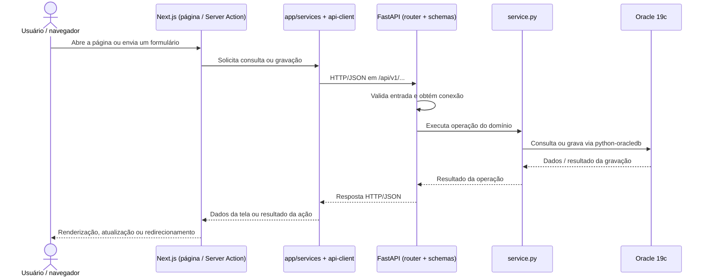

# OpsHub Facilities

Aplicação Next.js para indicadores de facilities, acompanhamento de chamados e criação de solicitações. O frontend utiliza o FastAPI como backend; somente o processo Python acessa o Oracle 19c.

## Funcionalidades e páginas

| Página | Rota | Recursos implementados |
|---|---|---|
| Home | `/pages/home` | Indicadores, mapa de atividades, filtros de período, status e unidade, e tabela paginada com 30, 60 ou 90 registros por página |
| Dashboard | `/pages/chamados/dashboard` | Indicadores e gráficos por categoria, status e mês, com filtros de período, unidade, categorias e status |
| Kanban | `/pages/chamados/kanbanboard` | Busca e filtros de chamados, alteração de status, criação/edição de visitas, executores, fotos, checklists e download de relatório PDF |
| Minhas solicitações | `/pages/minhas-solicitacoes` | Solicitações abertas e fechadas do membro configurado em `CURRENT_MEMBER_ID` |
| Catálogo | `/pages/solicitar-atividade` | Busca de serviços agrupados por categoria |
| Novo chamado | `/pages/solicitar-atividade/chamado?service_type_id=<id>` | Formulário do serviço selecionado, escolha obrigatória do solicitante, localização hierárquica, campos adicionais e anexos |

A rota `/` redireciona para a Home. O relatório PDF é gerado pelo backend com os filtros enviados pelo Kanban e disponibilizado ao navegador por `/api/requests/report`.

A página `/pages/solicitar-atividade/patio` ainda contém opções estáticas e não fornece todos os campos exigidos pela criação atual, como solicitante e região. Esse fluxo precisa ser concluído antes de uso operacional.

## Tecnologias e requisitos

- Frontend: Next.js **16.2.6** com App Router, React **19.2.4**, TypeScript e Tailwind CSS **4**.
- Backend: Python **3.10+**, FastAPI, Pydantic Settings, Uvicorn e `python-oracledb` em modo Thin; ReportLab e pypdf para relatórios.
- Ambiente: Node.js **20.9+**, npm e uma instância Oracle **19c** acessível, com tabelas e cadastros preparados. O modo Thin não exige Oracle Instant Client.

As versões JavaScript estão em `package.json` e `package-lock.json`; as faixas de dependências Python estão em `backend/requirements.txt`.

## Implantação na rede corporativa

Leia o [guia de implantação e segurança](docs/deployment.md) antes de liberar acesso.
A aplicação ainda não possui autenticação individual nem autorização por perfil: `CURRENT_MEMBER_ID` é compartilhado por todos os usuários. O piloto exige controle de acesso externo e participantes autorizados a acessar todos os dados e operações. A rede local, isoladamente, não oferece esse controle.

## Arquitetura

```text
Next.js (`app`, `src/server`)
  -> cliente HTTP server-side (`src/server/api-client.ts`)
  -> FastAPI (`backend/app/api`, com rotas versionadas em `api/v1`)
  -> python-oracledb / Oracle 19c
```

As mídias são servidas diretamente pelo FastAPI em URLs de mesma origem sob `/api/v1`. O Next.js encaminha somente essas rotas ao endereço interno configurado em `BACKEND_API_URL`; o proxy corporativo deve encaminhar todo o tráfego ao Next.js, mantendo a API inacessível pela rede.

Além das Server Actions, o Next.js possui Route Handlers em `app/api`: `/api/home/activities` consulta a paginação da Home e `/api/requests/report` encaminha o download de PDF. O cliente JSON utiliza `cache: "no-store"` e timeout padrão de 60 segundos.

A API mantém os módulos de domínio diretamente em `backend/app/api` e é organizada em `checklist`, `membership`, `organization`, `request`, `request_task` e `service_catalog`. Os domínios separam regras e persistência (`service.py`) e HTTP (`router.py`); contratos específicos ficam em `schemas.py`, quando necessário, e contratos compartilhados em `entities.py`. Os módulos Python usam `_` onde hífens não são identificadores válidos; as URLs públicas preservam `/request-tasks` e `/service-catalog`.

### Estrutura do repositório

```text
app/                  Páginas, componentes, Server Actions, serviços e tipos
src/server/           Cliente HTTP do backend e validações do servidor Next.js
backend/app/          API FastAPI, serviços de domínio e conexão Oracle
backend/tests/        Testes Python da API e integração Oracle opcional
tests/                Testes Node.js de mapeamento, cores e paginação
database/SqlScripts/  DDL Oracle e scripts históricos identificados nos guias
database/oracle/      Cargas iniciais convertidas para Oracle
database/import_tickets/  Importador de relatórios XLSX e seus testes
docs/                 Implantação e convenções visuais
documents/            Guia de banco e registro de validação dos serviços
```

## Elementos do frontend (`app/`)

Os nomes existentes no projeto são `services/`, `entities/navigation_entities/` e `entities/concrete_entity/`.

### `services/` — serviços da aplicação

Executam os casos de uso solicitados pelas páginas e Server Actions, como consultar indicadores ou criar uma solicitação.
Rodam exclusivamente no servidor Next.js e usam `src/server/api-client.ts` para enviar requisições HTTP ao backend Python.
Também preparam entradas de formulários e transformam respostas da API em dados de apresentação, com apoio de `mappers/entity-view-models.ts`.

### `entities/navigation_entities/` — modelos das telas

Definem os tipos de dados usados pela interface, incluindo cartões, filtros, gráficos, formulários e colunas do Kanban.
Organizam as informações conforme a necessidade de cada página, reunindo dados de entidades diferentes e atributos visuais, como cores e títulos.
Por exemplo, `minhas_solicitacoes_viewModels.ts` descreve cartões e listas de solicitações abertas e fechadas; esses modelos não representam tabelas do banco.

### `entities/concrete_entity/` — entidades persistidas

Definem tipos TypeScript que representam registros completos das tabelas, preservando identificadores, relações por chave estrangeira e campos anuláveis.
Arquivos como `request.ts`, `request-task.ts` e `location.ts` descrevem os dados persistidos; `database-types.ts` padroniza representações como datas, decimais e JSON.
São contratos de tipagem, sem consultas ou criação de tabelas; suas convenções e a relação completa de entidades estão no [README das entidades concretas](app/entities/concrete_entity/README.md).

### `entities/api/entity-responses.ts` — contratos de resposta HTTP

Descreve como as entidades e seus relacionamentos são agrupados nas respostas da API, por exemplo no contrato `RequestContext`.
Também define projeções específicas, como o resumo de um membro e referências de mídia com metadados e URL.
Esses contratos são recebidos pelos serviços e convertidos em modelos das telas pelos mapeadores; a tipagem TypeScript não valida o JSON em tempo de execução.

## Elementos do backend (`backend/`)

A API em execução está em `backend/app/`. Os arquivos abaixo pertencem aos módulos de domínio em `backend/app/api/`; o nome usado para schemas é `schemas.py`, no plural.

### `schemas.py` — contratos e validação de dados

Define modelos Pydantic para estruturar os dados de entrada e, quando declarado, de saída de uma operação.
Permite ao FastAPI validar tipos e restrições antes de executar a operação, como o tamanho da descrição em `request/schemas.py`.
Existe nos domínios `request`, `request_task` e `checklist`; os modelos compartilhados de entidades e respostas de leitura ficam em `api/entities.py`.

### `router.py` — endpoints HTTP

Define as URLs, os métodos HTTP, os parâmetros e os códigos de resposta de cada domínio usando `APIRouter`.
Recebe dados validados, obtém a conexão por `Depends(get_connection)` e chama o serviço correspondente, convertendo os erros tratados em respostas HTTP.
O arquivo `api/v1/router.py` reúne os routers, e `app/main.py` registra esse conjunto sob `/api/v1`, formando rotas como `POST /api/v1/requests`.

### `service.py` — regras de negócio e persistência

Implementa as operações do domínio, como validar a localização de uma solicitação, calcular indicadores e salvar visitas ou checklists.
Executa consultas e gravações SQL pela conexão recebida do router, usando a infraestrutura de `backend/app/database.py` e o driver `python-oracledb`.
Retorna dados para a camada HTTP e efetiva as gravações conforme a operação; o acesso ao Oracle 19c permanece exclusivamente no backend Python.

## Fluxo da página até o backend Python

As páginas são componentes React em arquivos `app/pages/**/page.tsx`, dos quais o Next.js produz a interface HTML exibida no navegador. Nas consultas e gravações de dados, os serviços TypeScript executam no servidor Next.js e se comunicam com o FastAPI por HTTP/JSON.


```mermaid
sequenceDiagram
    actor U as Usuário / navegador
    participant N as Next.js (página / Server Action)
    participant T as app/services + api-client
    participant R as FastAPI (router + schemas)
    participant P as service.py
    participant B as Oracle 19c
    U->>N: Abre a página ou envia um formulário
    N->>T: Solicita consulta ou gravação
    T->>R: HTTP/JSON em /api/v1/...
    R->>R: Valida entrada e obtém conexão
    R->>P: Executa operação do domínio
    P->>B: Consulta ou grava via python-oracledb
    B-->>P: Dados / resultado da gravação
    P-->>R: Resultado da operação
    R-->>T: Resposta HTTP/JSON
    T-->>N: Dados da tela ou resultado da ação
    N-->>U: Renderização, atualização ou redirecionamento
```

### Consulta e renderização de uma página

1. O navegador acessa uma rota, como `/pages/minhas-solicitacoes`, e o Next.js executa seu `page.tsx` no servidor.
2. A página chama `getMyRequestsPageData()`, em `app/services/request-service.ts`, para obter os dados necessários.
3. O serviço chama `backendJson()`, em `src/server/api-client.ts`, que envia `GET /api/v1/requests/mine` ao endereço de `BACKEND_API_URL`, com `cache: "no-store"`.
4. O router de `request` recebe a chamada e fornece a conexão ao serviço Python, que consulta as solicitações do membro definido por `CURRENT_MEMBER_ID`.
5. O backend monta os contratos `RequestContext` definidos em `api/entities.py` e devolve JSON contendo a solicitação e os dados relacionados.
6. No Next.js, `mapRequestCard()` converte cada resposta em um modelo de cartão; o serviço separa as solicitações abertas e fechadas, e a página renderiza a interface.

### Envio do formulário de um chamado

1. A página `app/pages/solicitar-atividade/chamado/page.tsx` consulta o catálogo e a hierarquia de localizações pelo serviço `activity-request-form-service.ts`, montando o formulário `ActivityRequestForm`.
2. Ao enviar o formulário HTML, o navegador aciona `createChamadoRequestAction()`, em `app/pages/solicitar-atividade/actions.ts`, com os valores em `FormData`.
3. A Server Action define o tipo de serviço e chama `createChamadoRequest()`. O serviço TypeScript verifica os campos básicos, organiza os campos adicionais e serializa arquivos em base64.
4. O cliente HTTP envia o JSON para `POST /api/v1/requests`. O FastAPI valida o corpo com `CreateRequest`, definido em `request/schemas.py`.
5. O router chama `create_request()`, em `request/service.py`, que verifica a relação entre empresa, região e localização e grava a solicitação, os valores adicionais e as mídias no Oracle 19c.
6. Após o `commit`, a API responde com status `201` e o identificador criado. A Server Action redireciona o navegador para `/pages/minhas-solicitacoes`, iniciando a consulta da lista atualizada.

Nesse envio, falhas de validação do contrato e os erros de negócio tratados pelo router retornam HTTP `422`. O cliente `backendJson()` propaga respostas HTTP de erro como exceções, impedindo o redirecionamento de sucesso.

O carregamento de mídias segue um caminho próprio: o navegador usa as URLs `/api/v1/service-catalog/media/{id}` ou `/api/v1/request-tasks/media/{id}`. Os rewrites do Next.js encaminham essas requisições ao FastAPI, que devolve o conteúdo binário.

## Documentação da migração

O código está adaptado para Oracle 19c (versão informada: 19.0.0.0.0). As tabelas usam o prefixo `OHFC_`, os nomes físicos das colunas seguem os scripts SQL e os contratos HTTP mantêm os nomes esperados pelo frontend. Nenhum schema proprietário é especificado nos scripts de criação ou selecionado pela aplicação.

| Documento | Responsabilidade |
|---|---|
| [Guia Oracle](documents/database.md) | Conexão, pool, tipos, consultas, transações e operação do backend |
| [Scripts SQL](database/SqlScripts/README.md) | DDLs Oracle e identificação dos scripts PostgreSQL legados |
| [Entidades e contratos](app/entities/concrete_entity/README.md) | Correspondência entre tabelas, tipos TypeScript e respostas HTTP |
| [Carga inicial Oracle](database/oracle/InsertTable/README.md) | Ordem de execução, contagens, validação e sincronização de identities |
| [Importador de chamados](database/import_tickets/README.md) | Prévia de XLSX, exportação SQL e importação recorrente |
| [Validação dos serviços](documents/validacao-services-oracle.md) | Registro da revisão estática, limites e pendências de homologação |

### Estado dos seis pontos da migração

| Ponto | Implementado no repositório | Trabalho restante |
|---|---|---|
| 1. Estrutura e nomes | Colunas alinhadas, 23 definições equivalentes e ausência de schema proprietário explícito | Conferência da estrutura implantada |
| 2. Conexão | `python-oracledb` Thin, pool, binds, leitura de LOBs e IDs com `RETURNING INTO` | Configuração e validação na instância Oracle |
| 3. Consultas | SQL executado pela API adaptado para Oracle 19c | Validação no Oracle; converter ou retirar de uso os exemplos históricos de `SqlQueries` |
| 4. Tipos e cargas | DDLs com NUMBER, VARCHAR2, CLOB, BLOB e regras Oracle de integridade | Homologar a carga Oracle e as identities; manter atualizações PostgreSQL fora da implantação |
| 5. Transações e contratos | Contratos HTTP preservados; visita e checklists sem commit intermediário | Validação real de gravações, rollback, tipos e datas |
| 6. Ambiente e documentação | Variáveis Oracle, guias, testes locais e teste de integração opcional | Migrations versionadas, homologação do procedimento de implantação/reversão |

A adaptação do código não significa que uma base foi migrada. Nenhum script de criação, carga ou atualização é executado automaticamente. A validação em Oracle real e o povoamento dos dados permanecem etapas separadas. Mesmo sem essas duas etapas, ainda faltam a conversão ou retirada dos scripts legados e a preparação operacional indicada acima.

### Cargas e importação

Os DDLs principais definem 23 tabelas. A carga inicial em `database/oracle/InsertTable` foi gerada para tabelas vazias; as duas tabelas auxiliares de auditoria da importação têm instalação e carga separadas. Siga a ordem do guia dessa pasta e não reaplique a carga inicial sobre uma base povoada.

O importador `database.import_tickets` interpreta relatórios XLSX. Por padrão, gera apenas uma prévia, sem conexão com o banco; a exportação SQL e a aplicação no Oracle são operações explícitas descritas no seu guia. Suas dependências adicionais estão em `database/import_tickets/requirements.txt`.

## Configuração

Copie [`.env.example`](.env.example) para `.env.local` somente se esse arquivo ainda não existir; caso já exista, atualize os campos necessários. Configure:

- `ORACLE_USER`, `ORACLE_PASSWORD`, `ORACLE_DSN`: credenciais e serviço Oracle usados apenas pelo FastAPI;
- `ORACLE_POOL_MIN`, `ORACLE_POOL_MAX`, `ORACLE_CALL_TIMEOUT_MS`: dimensionamento do pool e timeout de chamada; padrões de 1, 5 e 30000 ms, respectivamente;
- `BACKEND_API_URL`: endereço interno da API usado pelo servidor Next.js, com padrão `http://127.0.0.1:8000`; configure antes do build e mantenha no runtime, pois os rewrites de mídia são definidos no build;
- `API_DOCS_ENABLED`: habilita `/docs`, `/redoc` e `/openapi.json` no FastAPI; padrão `false`;
- `ALLOWED_DEV_ORIGINS`: hosts explícitos de desenvolvimento, sem protocolo, separados por vírgula; não altera as origens de Server Actions em produção;
- `CURRENT_MEMBER_ID`: membro usado no filtro de Minhas solicitações. Novos chamados exigem a escolha do solicitante no formulário, sem valor padrão; a seleção não constitui autenticação.

`DATABASE_URL` não é mais utilizada. A inicialização do FastAPI exige configuração Oracle válida. O Next.js não possui driver de banco nem fallback local para os dados.

O backend lê `.env` e `.env.local` a partir do diretório de trabalho; execute os comandos na raiz do repositório. As credenciais Oracle pertencem ao backend e não devem ser expostas em variáveis `NEXT_PUBLIC_*`.

Uploads aceitam até **10 MiB por arquivo**, com validação de base64 e formato do MIME na API. As Server Actions têm limite de corpo de **30 MB**; considere também a expansão de base64 e o limite agregado do proxy descrito no guia de implantação.

A correlação visual das categorias na Home e no Dashboard está documentada em [Cores das categorias](docs/category-colors.md). A migração dos dados deve preservar os IDs usados nessa correlação.

## Execução

Prepare a instância e as tabelas conforme [o guia Oracle](documents/database.md). O Compose legado PostgreSQL foi removido; o Oracle é provisionado separadamente.

Na raiz do projeto, em PowerShell:

```powershell
python -m venv .venv
.\.venv\Scripts\python.exe -m pip install -r backend/requirements.txt
.\.venv\Scripts\python.exe -m uvicorn backend.app.main:app --reload --host 127.0.0.1 --port 8000
```

Em outro terminal:

```powershell
npm ci
npm run dev
```

Em Linux/macOS, o executável do ambiente virtual fica em `.venv/bin/python`. O frontend fica em `http://localhost:3000`; a documentação OpenAPI pode ser habilitada localmente com `API_DOCS_ENABLED=true` em `http://localhost:8000/docs`. Por padrão está desabilitada.

O desenvolvimento usa Webpack. Para testar Turbopack, execute `npm run dev:turbopack`. Se houver artefatos de uma árvore anterior de rotas, execute `npm run clean` antes de reiniciar o servidor.

| Comando npm | Finalidade |
|---|---|
| `npm run dev` | Desenvolvimento com Webpack, em `127.0.0.1` |
| `npm run dev:turbopack` | Desenvolvimento com Turbopack, em `127.0.0.1` |
| `npm run clean` | Remove a pasta gerada `.next` |
| `npm run lint` | Executa ESLint |
| `npm run build` | Gera o build de produção |
| `npm start` | Inicia o build de produção, em `127.0.0.1` |

Para o piloto corporativo, siga o [guia de implantação](docs/deployment.md): API sem `--reload`, frontend com build e `npm start`, e acesso por proxy HTTPS autenticado.

## Verificações

Na raiz do projeto:

```powershell
.\.venv\Scripts\python.exe -m unittest discover -s backend/tests -v
node --test tests/*.test.mjs
npm run lint
npm run build
node node_modules/typescript/bin/tsc --noEmit --incremental false
```

Os testes locais cobrem a camada de acesso, contratos, consultas geradas e equivalência dos DDLs. O teste de integração é ignorado quando as variáveis `ORACLE_TEST_*` não estão definidas no ambiente do processo; sua configuração e limites estão no [guia Oracle](documents/database.md#teste-de-integração-opcional). `/health` retorna o estado do processo e não executa uma consulta de conectividade.

Há também testes de relatórios PDF, uploads, alteração de status e paginação. Para validar o importador após instalar suas dependências:

```powershell
.\.venv\Scripts\python.exe -m unittest discover -s database/import_tickets/tests -v
```

Esses comandos são instruções de verificação, não evidência de homologação em Oracle. O registro de validação dos serviços documenta pendências de precisão do timestamp final de visitas e de configuração do fuso da sessão.

## Fluxos atendidos pela API

- `checklist`: definições e checklists vinculados a visitas;
- `membership`: opções de executores e solicitantes;
- `organization`: hierarquia de business, region e location;
- `request`: home, dashboard, kanban, paginação, listagem/criação de solicitações, alteração de status e relatório PDF;
- `request-task`: criação/edição de visitas e mídia;
- `service-catalog`: catálogo, formulário dinâmico e mídia de solicitações.
