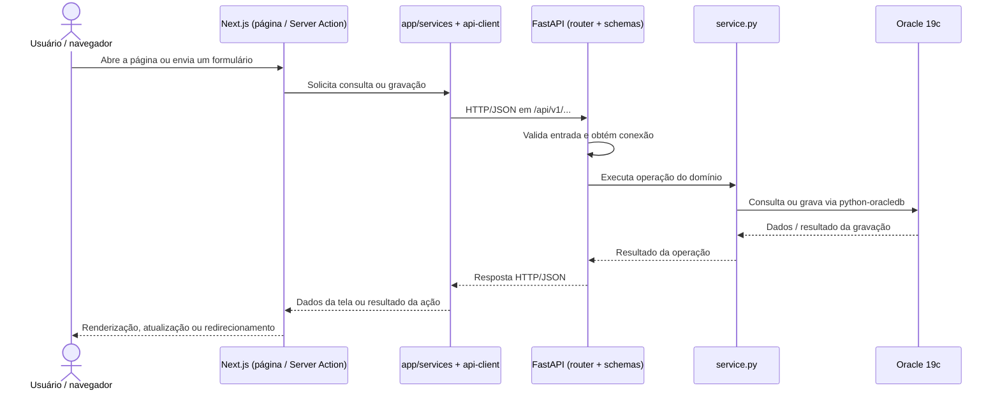

# Arquitetura e fluxos do frontend

Este documento usa caminhos relativos a raiz do repositorio frontend. Referencias ao codigo Python descrevem o repositorio backend independente.

## Funcionalidades e páginas

| Página | Rota | Recursos implementados |
|---|---|---|
| Home | `/pages/home` | Indicadores, mapa de atividades, filtros de período, status e unidade, e tabela paginada com 30, 60 ou 90 registros por página |
| Dashboard | `/pages/chamados/dashboard` | Indicadores e gráficos por categoria, status e mês, com filtros de período, unidade, categorias e status |
| Kanban | `/pages/chamados/kanbanboard` | Busca e filtros de chamados, alteração de status, criação/edição de visitas, executores, fotos, checklists e download de relatório PDF |
| Minhas solicitações | `/pages/minhas-solicitacoes` | Solicitações abertas e fechadas do membro configurado em `CURRENT_MEMBER_ID` |
| Catálogo | `/pages/solicitar-atividade` | Busca de serviços agrupados por categoria |
| Novo chamado | `/pages/solicitar-atividade/chamado?service_type_id=<id>` | Formulário do serviço selecionado, escolha obrigatória do solicitante, localização hierárquica, campos adicionais e anexos |

A rota `/` redireciona para a Home. O relatório PDF é gerado pelo backend com os filtros enviados pelo Kanban e disponibilizado ao navegador por `/api/requests/report`.

A página `/pages/solicitar-atividade/patio` ainda contém opções estáticas e não fornece todos os campos exigidos pela criação atual, como solicitante e região. Esse fluxo precisa ser concluído antes de uso operacional.

## Elementos do frontend (`app/`)

Os nomes existentes no projeto são `services/`, `entities/navigation_entities/` e `entities/concrete_entity/`.

### `services/` — serviços da aplicação

Executam os casos de uso solicitados pelas páginas e Server Actions, como consultar indicadores ou criar uma solicitação.
Rodam exclusivamente no servidor Next.js e usam `app/services/api-client.ts` para enviar requisições HTTP ao backend Python.
Também preparam entradas de formulários e transformam respostas da API em dados de apresentação, com apoio de `mappers/entity-view-models.ts`.

### `entities/navigation_entities/` — modelos das telas

Definem os tipos de dados usados pela interface, incluindo cartões, filtros, gráficos, formulários e colunas do Kanban.
Organizam as informações conforme a necessidade de cada página, reunindo dados de entidades diferentes e atributos visuais, como cores e títulos.
Por exemplo, `minhas_solicitacoes_viewModels.ts` descreve cartões e listas de solicitações abertas e fechadas; esses modelos não representam tabelas do banco.

### `entities/concrete_entity/` — entidades persistidas

Definem tipos TypeScript que representam registros completos das tabelas, preservando identificadores, relações por chave estrangeira e campos anuláveis.
Arquivos como `request.ts`, `request-task.ts` e `location.ts` descrevem os dados persistidos; `database-types.ts` padroniza representações como datas, decimais e JSON.
São contratos de tipagem, sem consultas ou criação de tabelas; suas convenções e a relação completa de entidades estão no [README das entidades concretas](../app/entities/concrete_entity/README.md).

### `entities/api/entity-responses.ts` — contratos de resposta HTTP

Descreve como as entidades e seus relacionamentos são agrupados nas respostas da API, por exemplo no contrato `RequestContext`.
Também define projeções específicas, como o resumo de um membro e referências de mídia com metadados e URL.
Esses contratos são recebidos pelos serviços e convertidos em modelos das telas pelos mapeadores; a tipagem TypeScript não valida o JSON em tempo de execução.

## Fluxo da página até o backend Python

As páginas são componentes React em arquivos `app/pages/**/page.tsx`, dos quais o Next.js produz a interface HTML exibida no navegador. Nas consultas e gravações de dados, os serviços TypeScript executam no servidor Next.js e se comunicam com o FastAPI por HTTP/JSON.

### Consulta e renderização de uma página

1. O navegador acessa uma rota, como `/pages/minhas-solicitacoes`, e o Next.js executa seu `page.tsx` no servidor.
2. A página chama `getMyRequestsPageData()`, em `app/services/request-service.ts`, para obter os dados necessários.
3. O serviço chama `backendJson()`, em `app/services/api-client.ts`, que envia `GET /api/v1/requests/mine` ao endereço de `BACKEND_API_URL`, com `cache: "no-store"`.
4. O router de `request` recebe a chamada e fornece a conexão ao serviço Python, que consulta as solicitações do membro definido por `CURRENT_MEMBER_ID`.
5. O backend monta os contratos `RequestContext` definidos em `api/entities.py` e devolve JSON contendo a solicitação e os dados relacionados.
6. No Next.js, `mapRequestCard()` converte cada resposta em um modelo de cartão; o serviço separa as solicitações abertas e fechadas, e a página renderiza a interface.

### Envio do formulário de um chamado

1. A página `app/pages/solicitar-atividade/chamado/page.tsx` consulta o catálogo e a hierarquia de localizações pelo serviço `activity-request-form-service.ts`, montando o formulário `ActivityRequestForm`.
2. Ao enviar o formulário HTML, o navegador aciona `createChamadoRequestAction()`, em `app/pages/solicitar-atividade/actions.ts`, com os valores em `FormData`.
3. A Server Action define o tipo de serviço e chama `createChamadoRequest()`. O serviço TypeScript verifica os campos básicos, organiza os campos adicionais e serializa arquivos em base64.
4. O cliente HTTP envia o JSON para `POST /api/v1/requests`. O FastAPI valida o corpo com `CreateRequest`, definido em `request/schemas.py`.
5. O router chama `create_request()`, em `request/service.py`, que verifica a relação entre empresa, região e localização e grava a solicitação, os valores adicionais e as mídias no Oracle 19c.
6. Após o `commit`, a API responde com status `201` e o identificador criado. A Server Action redireciona o navegador para `/pages/minhas-solicitacoes`, iniciando a consulta da lista atualizada.

Nesse envio, falhas de validação do contrato e os erros de negócio tratados pelo router retornam HTTP `422`. O cliente `backendJson()` propaga respostas HTTP de erro como exceções, impedindo o redirecionamento de sucesso.

O carregamento de mídias segue um caminho próprio: o navegador usa as URLs `/api/v1/service-catalog/media/{id}` ou `/api/v1/request-tasks/media/{id}`. Os rewrites do Next.js encaminham essas requisições ao FastAPI, que devolve o conteúdo binário.
